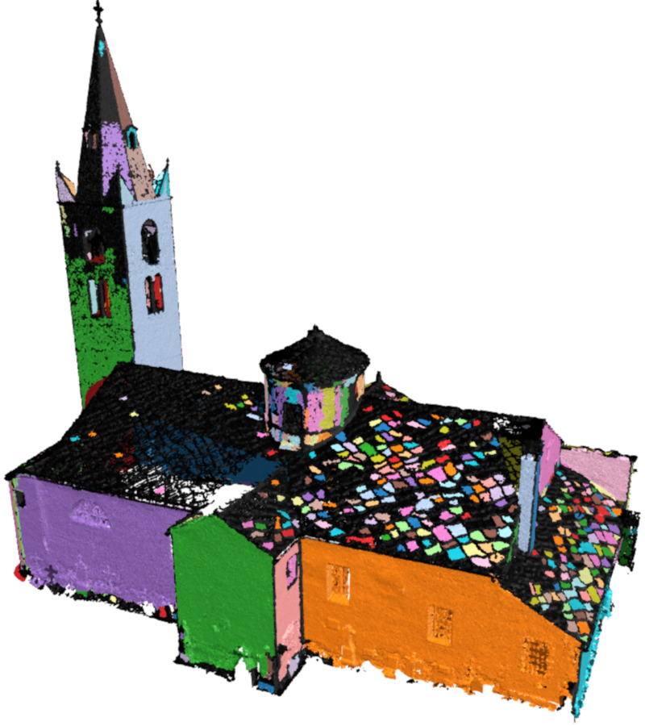
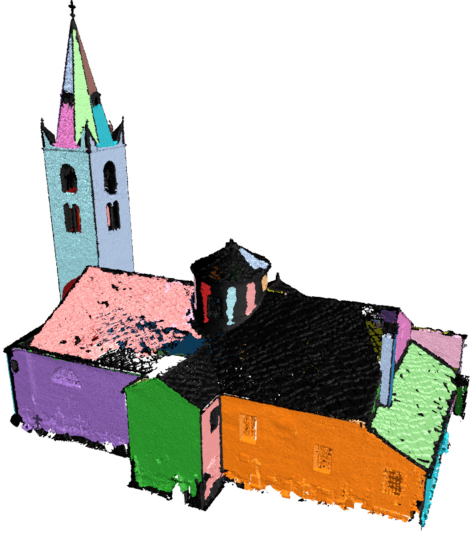
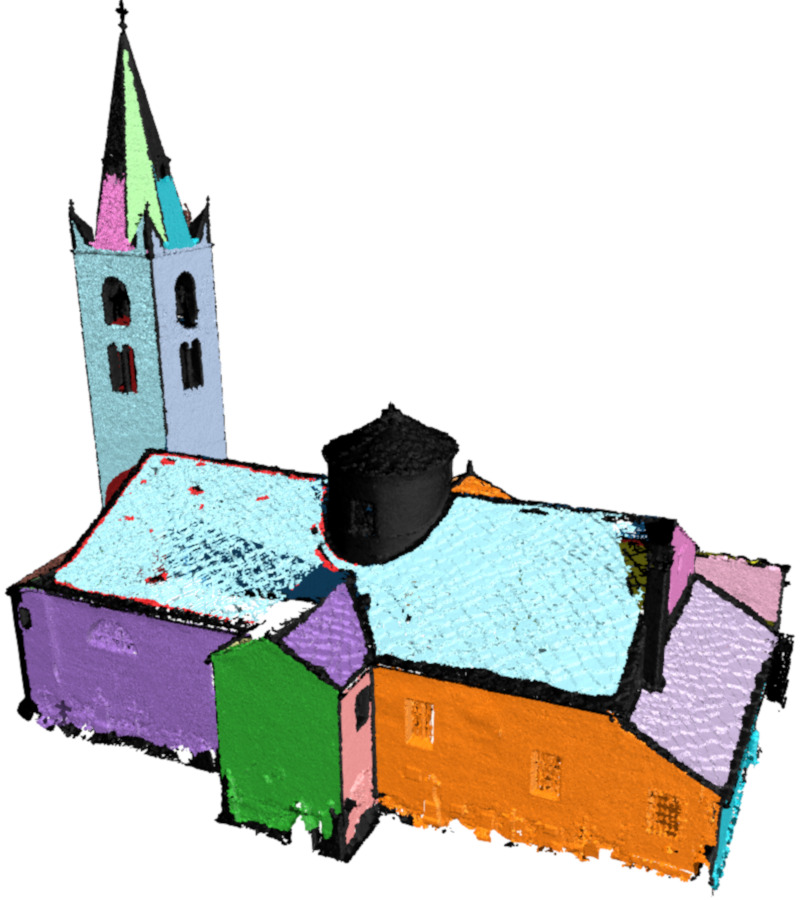
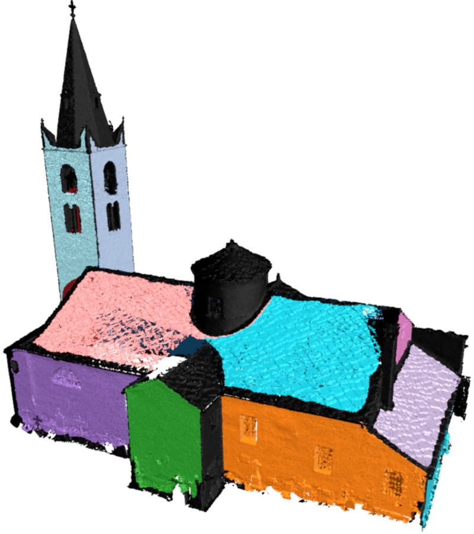

# Plane Detection in 3D Point Clouds

This c++ project is the authors implementation of the following article   

## Persistence Analysis of Multi-scale Planar Structure Graph in Point Clouds [(PDF)](https://hal.archives-ouvertes.fr/hal-02490721/document)  

*Thibault Lejemble*  
*Claudio Mura*  
*Loïc Barthe*  
*Nicolas Mellado*  

Computer Graphics Forum 2020  
Eurographics 2020  

**Abstract**  
Abstract Modern acquisition techniques generate detailed point clouds that sample complex geometries. For instance, we are able to produce millimeter-scale acquisition of whole buildings. Processing and exploring geometrical information within such point clouds requires scalability, robustness to acquisition defects and the ability to model shapes at different scales. In this work, we propose a new representation that enriches point clouds with a multi-scale planar structure graph. We define the graph nodes as regions computed with planar segmentations at increasing scales and the graph edges connect regions that are similar across scales. Connected components of the graph define the planar structures present in the point cloud within a scale interval. For instance, with this information, any point is associated to one or several planar structures existing at different scales. We then use topological data analysis to filter the graph and provide the most prominent planar structures. Our representation naturally encodes a large range of information. We show how to efficiently extract geometrical details (e.g. tiles of a roof), arrangements of simple shapes (e.g. steps and mean ramp of a staircase), and large-scale planar proxies (e.g. walls of a building) and present several interactive tools to visualize, select and reconstruct planar primitives directly from raw point clouds. The effectiveness of our approach is demonstrated by an extensive evaluation on a variety of input data, as well as by comparing against state-of-the-art techniques and by showing applications to polygonal mesh reconstruction.

## Getting Started

The script `replicate.sh` downloads the required dependencies, compile the code, and generates a subset of the data shown by the figures of the article.
The following sections give some details on these different steps. 

### Depencencies

The only required dependency is the C++ header-only library [CGAL](https://github.com/CGAL/cgal).  
To obtain CGAL on Linux use
```
sudo apt-get install libcgal-dev
```   
Other depencencies like [Eigen](https://gitlab.com/libeigen/eigen) and [Ponca](https://github.com/poncateam/ponca) are directly included in the sources of this project. 

### Compilation

To download the project and compile the code run the following commands  
```
git clone git@github.com:ThibaultLejemble/Plane-Detection-Point-Cloud.git
cd Plane-Detection-Point-Cloud
mkdir build
cd build
cmake -DCMAKE_BUILD_TYPE=Release ..
make -j 
```

Tested using
- Ubuntu 20.04.1 LTS
  - cmake 3.16.3
  - g++ 9.3.0
  - CGAL 5.0.2
- Debian GNU/Linux 10 (buster)
  - cmake 3.13.4
  - g++ 8.3.0
  - CGAL 5.1
- MacOSX

### Usage

#### Replicate results 

Several scripts available in the [figures](https://github.com/ThibaultLejemble/Plane-Detection-Point-Cloud/tree/main/figures) directory generate the data shown by a subset of the figures presented in the article **Persistence Analysis of Multi-scale Planar Structure Graph in Point Clouds [(PDF)](https://hal.archives-ouvertes.fr/hal-02490721/document)**.

Once the project is compiled (see above), run the following command from the [figures](https://github.com/ThibaultLejemble/Plane-Detection-Point-Cloud/tree/main/figures) directory
```
./generate.sh
```
The resulting colored point clouds are contained in several PLY files `fig_*.ply` contained in one folder for each figure.

The following images show the results for the Figure 15-b from the folder `fig_015b` using scale thresholds 5, 15, 20 and 25
| |  |  | |
|-------------------------|--------------------------|--------------------------|-------------------------|
|`fig_15b_005.ply`        | `fig_15b_015.ply`        | `fig_15b_020.ply`        | `fig_15b_025.ply`       |

<!-- Note that it takes around 40 minutes with 8 cores at 3.70GHz and 32G of RAM.  -->

#### Process other 3D point clouds

To process any point cloud given as a PLY file `mycloud.ply` (OBJ files are handled as well), first run the following commands to preprocess the data
```
pdpcComputeMultiScaleFeatures -v -i mycloud.ply -o mycloud
pdpcSegmentation -v -i mycloud.ply -s mycloud_scales.txt -f mycloud_features.txt -o mycloud
``` 
The first program `pdpcComputeMultiScaleFeatures` computes surface curvatures and normals from the point cloud at multiple scales.
The second program `pdpcSegmentation` performs planar region growings at all scales. 
Note that an oriented normal vector is required for each input point. 

Finally, the program `pdpcPostProcess` can perform 3 different operations depending on the given options
```
pdpcPostProcess -v -i mycloud.ply -s mycloud_seg.txt -c mycloud_comp.txt -o results1 -range 0 9 10 19 20 29 30 39 40 49 
pdpcPostProcess -v -i mycloud.ply -s mycloud_seg.txt -c mycloud_comp.txt -o results2 -pers 10 15 20 25 30 35 40
pdpcPostProcess -v -i mycloud.ply -s mycloud_seg.txt -c mycloud_comp.txt -o results3 -scales 5 10 15 20 25 30 35
```
- `-range birth1 death1 birth2 death2` generates two files showing components that persist in the scale ranges (`birth1`,`death1`) and (`birth2`,`death2`)
- `-pers pers1 pers2` generates two files showing components that are more persistent than the persistence thresholds `pers1` and `pers2`
- `-scale scale1 scale2` generates two files showing the most persistent components that include the scale thresholds `scale1` and `scale2`

Results are generated as text files with one integer per line corresponding to one label per point (where `-1` means that the point is unlabeled). 
Add the option `-col` so that the colored PLY files are also generated. 
To modify some parameters please check the help of the programs by running them with the option `-h`.

___

Please cite this paper if you use this code
```
@article{lejemble2020persistence,
  author = {Lejemble, Thibault and Mura, Claudio and Barthe, Loïc and Mellado, Nicolas},
  title = {Persistence Analysis of Multi-scale Planar Structure Graph in Point Clouds},
  journal = {Computer Graphics Forum},
  volume = {39},
  number = {2},
  pages = {35-50},
  doi = {https://doi.org/10.1111/cgf.13910},
  url = {https://onlinelibrary.wiley.com/doi/abs/10.1111/cgf.13910},
  year = {2020}
}
```

